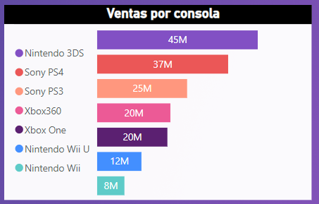

# Mercado de videojuegos

En este proyecto, vamos a:

- Analizar el mercado de videojuegos con el objetivo de identificar posibles nichos, en donde se pueden desarrollar nuevos productos. 

- Encontrar los insights y presentarlos, suponiendo que nuestra audiencia es un grupo inversor dispuesto a invertir en el desarrollo de nuevos productos.

- Las bases de datos que vamos a utilizar requiere que nos centremos en los años 2012, 2013, 2014 y 2015

- La herramienta que utilizaremos va a ser Power BI

## Plataformas

En el mercado actual de videojuegos pudimos observar que las consolas dominan por un amplio márgen por sobre la PC, donde Sony encabeza la venta de juegos sacando un 10% de diferencia a Microsoft, ubicado segundo en la tabla.

## Consolas

Aunque Sony tenga una notoria diferencia en la venta de juegos, en cuanto a consolas vendidas los números cambian. Nintendo y Sony encabezan la tabla dominando el 76% del mercado, dejando a Microsoft como la empresa que menos vendió con el 24% de las ventas.
Pero esto parece estar cambiando, ya que Sony está en un alza de ventas, mientras que Nintendo se encuentra en caída 

Entre todas las compañías, la consola más vendida en este período fue la Nintendo 3DS, con un total de 45 millones.

## Categoría de videojuegos

En cuanto a las categorías, predominan juegos de acción y los shooters, tambien conocidos como FPS, seguidos por Role-playing y deportes.

## Region

En cuanto a ventas por regiones, pudimos confirmar que tanto Estados Unidos y Europa son las zonas que más juegos venden comparados al resto del mundo.

También utilizamos datos de ingresos per cápita de los países, para ver si encontrábamos una relación con la venta de juegos, pero los datos no mostraron una relación direct, ya que muestra a Estados Unidos primero, pero muy por debajo se encuentra Europa con Japón, lo cual no es consistente con las ventas de juegos por región.

## Edad 

 Una de las formas para predecir las ventas por edad es por la guía de clasificaciones Entertainment Software Rating Board (ESRB), como para tener una idea aproximada de a qué público está dirigido el videojuego.

Podemos observar como los juegos más vendidos son los rango M(+17) y los E(para todos).

# Conclusión

A la hora de determinar el primer juego de una empresa, el grupo inversor podría tomar en cuenta los datos provistos y tratar de apuntar a las áreas más concluyentes para no arriesgarse a crear un juego que no llegue a muchas personas.

* **Plataforma**: la mayor cantidad de ventas se genera a través de las consolas.
* **Consola:** Sony, al ser los que más juegos venden, sería una buena elección, y aunque su mayoría de ventas sean en la Playstation 3, lo más lógico sería ir por la Playstation 4, ya que es la consola más moderna y va a ir tomando lugar. No habría mucho riesgo sabiendo que Playstation domina las ventas hace años.
* **Categoría:** Shooters o juegos de acción serían una buena elección, al ser los que más venden, aunque también debería entrar en consideración los juegos de deportes o role-play
* **Región:** un enfoque al público de Estados Unidos y Europa sería lo más efectivo
* **Edad:** tanto un juego de rango E (para todos) como uno M(+17) sería lo más seguro, ya que los otros rangos no consiguen una alta cantidad de ventas.

